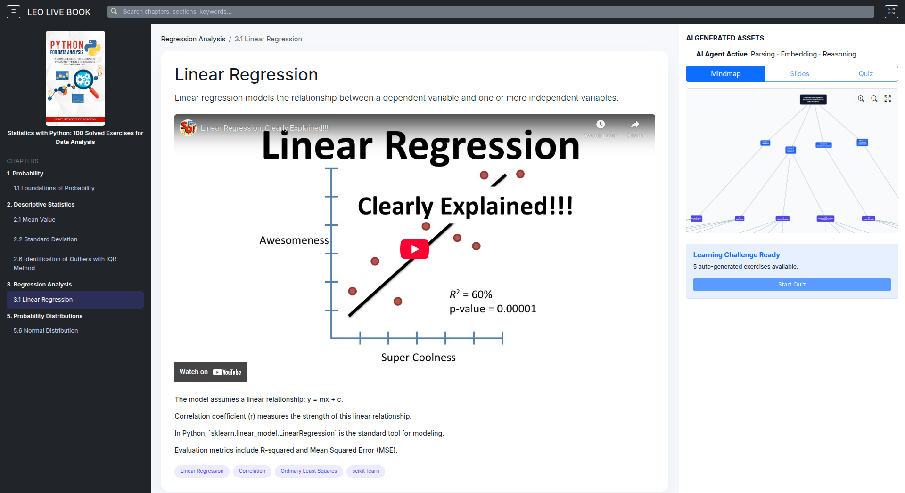

# LEO LIVE BOOK

**Turning Static Knowledge into Interactive Learning Ecosystems.**

**LEO LIVE BOOK** is an AI-native engine designed to transform any book—academic, professional, or personal—into a structured, multi-dimensional learning experience. By leveraging Python, LLM AI Agents (Google Gemini), and high-performance vector databases, LEO LIVE BOOK automates the entire pedagogical pipeline: from raw text extraction to the generation of lecture slides, mindmaps, and auto-graded assessments.

The project is part of the broader [LEO CDP Framework](https://github.com/trieu/leo-cdp-framework) ecosystem, focusing on the intelligence layer of knowledge management.

---

### 🚀 Key Capabilities

LEO LIVE BOOK goes beyond simple summarization; it acts as a **Virtual Professor** and **Content Architect**:

* **Universal Book Ingestion:** Parse PDFs, EPUBs, and text files into structured data.
* **AI Agent Intelligence:** Automated extraction of core concepts, keywords, and semantic summaries.
* **Dynamic Lecture Material:** Automatically generate structured lecture slides and presentation outlines from book chapters.
* **Visual Knowledge Maps:** Generate Mermaid.js or Graphviz code to visualize book structures as interactive mindmaps.
* **Active Pedagogy:** * Automatic generation of exercises (Multiple Choice, Q&A, Case Studies).
* **Auto-Grading Engine:** Real-time evaluation of student answers with personalized feedback.

* **Life-Long Learning:** A persistent knowledge graph that tracks student progress and adapts content based on mastery.

---

### 🛠 The Intelligence Stack

LEO LIVE BOOK combines a robust data architecture with cutting-edge AI:

1. **Extraction Layer (Python + LLM):** Uses `PyPDF2` and `google-genai` to batch-process book content, maintaining context across thousands of pages.
2. **Memory Layer (PostgreSQL + pgvector):** Stores book sections as vector embeddings to support Retrieval-Augmented Generation (RAG) and semantic search.
3. **Reasoning Layer (AI Agents):** Specialized agents for different tasks:
* *The Analyst:* Extracts keywords and summaries.
* *The Designer:* Creates slide decks and mindmaps.
* *The Examiner:* Crafts exercises and grades submissions.

---

### 📖 Workflow: From PDF to Professor

1. **Ingest:** The Python engine parses the PDF and creates a structured map of Chapters, Sections, and Exercises.
2. **Index:** Content is vectorized and stored in **PostgreSQL 16** for instant semantic retrieval.
3. **Generate:** * **Slides:** Creates Markdown/PPTX-ready outlines for instructors.
* **Visuals:** Generates hierarchical mindmaps of the book's logic.
* **Drills:** Produces practice questions based on specific sections.

4. **Assess:** Students submit answers; the AI Agent compares them against the book's "source of truth," provides a grade, and explains *why* the answer was right or wrong.

---

### 🏗 Knowledge Model (PostgreSQL Schema)

The system organizes data into four primary layers to support life-long learning:

* **Source Material:** Structured text, page references, and book metadata.
* **Knowledge Assets:** Keywords, summaries, slides, and mindmap nodes.
* **Assessment Bank:** Generated exercises, correct answers, and grading rubrics.
* **Student Ledger:** History of attempts, grades, and mastery levels for specific topics.

---

### 🌟 Design Principles

* **Source Fidelity:** Every AI-generated summary or slide is traceable back to a specific page and paragraph in the original book.
* **Agentic Autonomy:** AI Agents handle the heavy lifting of content creation, allowing human learners to focus on synthesis and application.
* **Multi-Modal Learning:** Information is presented via text (summaries), visuals (mindmaps), and activity (exercises).
* **Framework Agnostic:** While optimized for Gemini, the core logic is model-agnostic and schema-first.

---

### 🎯 Intended Use Cases

* **Corporate Training:** Turn technical manuals into interactive certification courses.
* **Higher Education:** Automate the creation of study guides and lecture slides for textbooks.
* **Self-Directed Learning:** Upload any non-fiction book to receive a personalized curriculum and "final exam."
* **Content Publishing:** Help authors provide "Active Learning" versions of their books.

---

### Why LEO LIVE BOOK?

Most AI tools just summarize text. **LEO LIVE BOOK** builds a bridge between **reading** and **mastery**. It ensures that the knowledge contained within a book isn't just stored in a database, but is actively taught, tested, and visualized.

**Don't just read the book. Live the book.**

---

*For development and contribution, visit the core repository: [leo-live-book*](https://github.com/trieu/leo-live-book)
